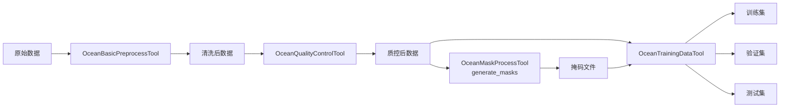

# Ocean Data Preprocess Tool - Migration Summary

## 概述

原始的 `OceanDataPreprocessTool` 已被拆分为 **5 个专业化工具** + **1 个全流程工具** + **1 个共享工具库**，以提高模块化、可维护性和可重用性。

## 架构变更

### 原始架构
```
OceanDataPreprocessTool (单一工具)
├── 所有操作混在一起
├── 重复的辅助函数
└── 难以维护和扩展
```

### 新架构
```
@utils/oceanData (共享工具库)
├── 数据解析、序列化
├── 统计计算
└── 通用辅助函数

5个专业化工具
├── OceanBasicPreprocessTool (基础预处理)
├── OceanDataFilterTool (数据过滤)
├── OceanQualityControlTool (质量控制)
├── OceanMaskProcessTool (掩码处理)
└── OceanTrainingDataTool (训练数据生成)

OceanFullPreprocessTool (全流程编排工具)
└── 通过配置调用上述5个工具
```

---

## 工具详细说明

### 1. 共享工具库: `@utils/oceanData/index.ts`

**位置**: `src/utils/oceanData/index.ts`

**功能**:
- 数据解析 (`parseCSV`, `parseJSON`, `parseDataFile`)
- 数据序列化 (`serializeData`, `inferOutputFormat`)
- 数据预览生成 (`generatePreview`)
- 统计计算 (`calculateStatistics`, `calculateColumnStatistics`)
- 辅助函数 (`findNumericColumns`, `isMissing`, `getMetadata`)

**数据格式**:
```typescript
// 标准化的数据格式
export interface OceanDataRow {
  [key: string]: number | string | null | undefined
}
export type OceanData = OceanDataRow[]

// 标准化的结果格式
export interface OceanDataResult {
  data: OceanData
  warnings: string[]
  metadata?: Record<string, any>
}
```

**优势**:
- ✅ 避免代码重复
- ✅ 统一数据格式
- ✅ 易于测试和维护
- ✅ 所有工具可无缝传递数据

---

### 2. 基础预处理工具: `OceanBasicPreprocessTool`

**位置**: `src/tools/OceanBasicPreprocessTool/`

**操作**:
- `clean` - 删除缺失值和重复数据
- `normalize` - 归一化到 [0, 1]
- `standardize` - 标准化 (z-score)
- `interpolate` - 插值缺失值
- `statistics` - 计算统计量

**示例**:
```typescript
{
  "file_path": "/path/to/data.csv",
  "operations": ["clean", "interpolate", "normalize"],
  "output_path": "/path/to/preprocessed.csv"
}
```

**使用场景**:
- 数据清洗
- 特征标准化
- 基础统计分析

---

### 3. 数据过滤工具: `OceanDataFilterTool`

**位置**: `src/tools/OceanDataFilterTool/`

**过滤参数**:
- `start_date` / `end_date` - 时间范围
- `min_depth` / `max_depth` - 深度范围
- `latitude_range` / `longitude_range` - 地理范围
- `min_temperature` / `max_temperature` - 温度范围
- `min_salinity` / `max_salinity` - 盐度范围

**示例**:
```typescript
{
  "file_path": "/path/to/data.csv",
  "filter_params": {
    "latitude_range": [20, 40],
    "longitude_range": [-80, -60],
    "min_depth": 0,
    "max_depth": 100
  },
  "output_path": "/path/to/filtered.csv"
}
```

**使用场景**:
- 提取特定区域数据
- 选择特定深度层
- 时间序列切片

---

### 4. 质量控制工具: `OceanQualityControlTool`

**位置**: `src/tools/OceanQualityControlTool/`

**质量检查**:
- `temp_range` - 温度合理范围 (默认: [-2, 40]°C)
- `salinity_range` - 盐度合理范围 (默认: [0, 42] PSU)
- `pressure_range` - 压力合理范围 (默认: [0, 12000] dbar)
- `check_spikes` - 尖峰异常检测
- `spike_threshold` - 尖峰检测阈值 (默认: 3σ)

**示例**:
```typescript
{
  "file_path": "/path/to/data.csv",
  "quality_params": {
    "temp_range": [-2, 35],
    "salinity_range": [30, 40],
    "check_spikes": true
  },
  "remove_outliers": true,
  "output_path": "/path/to/qc_data.csv"
}
```

**使用场景**:
- 数据质量评估
- 异常值检测和移除
- 符合海洋学标准的数据验证

---

### 5. 掩码处理工具: `OceanMaskProcessTool`

**位置**: `src/tools/OceanMaskProcessTool/`

**操作**:
- `generate_masks` - 生成陆地和云掩码
- `apply_masks` - 应用掩码创建缺失数据
- `analyze_masks` - 分析掩码统计信息

**掩码类型**:
- **陆地掩码**: 始终缺失的像素（所有时间帧都是 NaN）
- **云掩码**: 时间性缺失数据（特定缺失率范围）

**示例**:
```typescript
// 生成掩码
{
  "file_path": "/path/to/data.csv",
  "operation": "generate_masks",
  "mask_params": {
    "missing_ratio_range": [0.1, 0.6],
    "mask_count": 360
  },
  "output_path": "/path/to/masks.json"
}

// 应用掩码
{
  "file_path": "/path/to/complete_data.csv",
  "operation": "apply_masks",
  "mask_file_path": "/path/to/masks.json",
  "output_path": "/path/to/masked_data.json"
}
```

**使用场景**:
- 生成训练数据的掩码
- 模拟真实的缺失数据模式
- 掩码统计分析

---

### 6. 训练数据生成工具: `OceanTrainingDataTool`

**位置**: `src/tools/OceanTrainingDataTool/`

**操作**:
- `build_pairs` - 构建输入/真值对
- `split_dataset` - 分割训练/验证/测试集
- `validate_pairs` - 验证数据对质量

**数据对格式**:
```typescript
{
  "input": { ...带掩码的数据... },
  "groundTruth": { ...完整数据... },
  "maskIndex": 0,
  "missingRatio": 0.25
}
```

**示例**:
```typescript
// 构建并分割数据集
{
  "ground_truth_path": "/path/to/complete.csv",
  "mask_file_path": "/path/to/masks.json",
  "operation": "split_dataset",
  "split_params": {
    "train_ratio": 0.7,
    "val_ratio": 0.15,
    "test_ratio": 0.15,
    "shuffle": true
  },
  "output_dir": "/path/to/training_data"
}
```

**输出文件**:
- `train.json` - 训练集
- `val.json` - 验证集
- `test.json` - 测试集

**使用场景**:
- 机器学习训练数据准备
- 数据重建模型训练
- 缺失数据填补研究

---

### 7. 全流程工具: `OceanFullPreprocessTool`

**位置**: `src/tools/OceanFullPreprocessTool/`

**预定义工作流**:

#### a) `basic_preprocess`
```
clean → interpolate → normalize → statistics
```

#### b) `quality_analysis`
```
clean → statistics → quality_control (report only)
```

#### c) `training_prep`
```
clean → normalize → quality_control (remove outliers) → generate_masks
```

#### d) `custom`
自定义管道配置

**示例**:
```typescript
// 使用预定义工作流
{
  "file_path": "/path/to/data.csv",
  "workflow": "training_prep",
  "output_dir": "/path/to/output"
}

// 自定义管道
{
  "file_path": "/path/to/data.csv",
  "workflow": "custom",
  "pipeline_config": {
    "basic_preprocess": {
      "operations": ["clean", "normalize"]
    },
    "filter": {
      "enabled": true,
      "params": { "latitude_range": [20, 40] }
    },
    "quality_control": {
      "enabled": true,
      "remove_outliers": true
    },
    "mask_process": {
      "enabled": true,
      "operation": "generate_masks"
    }
  },
  "output_dir": "/path/to/output"
}
```

**优势**:
- ✅ 一次调用完成多个步骤
- ✅ 预定义工作流保证一致性
- ✅ 自动处理步骤间的数据传递
- ✅ 完整的日志和结果追踪

---

## 使用指南

### 选择合适的工具

| 需求 | 推荐工具 |
|------|---------|
| 只需要基础清洗和标准化 | `OceanBasicPreprocessTool` |
| 按地理/时间/参数范围过滤 | `OceanDataFilterTool` |
| 数据质量检查和验证 | `OceanQualityControlTool` |
| 生成或处理掩码 | `OceanMaskProcessTool` |
| 准备机器学习训练数据 | `OceanTrainingDataTool` |
| 完整的预处理流程 | `OceanFullPreprocessTool` |

### 典型工作流示例

#### 工作流 1: 数据清洗与分析
```
1. OceanBasicPreprocessTool (clean, statistics)
2. OceanQualityControlTool (quality check)
3. OceanDataFilterTool (filter by region)
```

#### 工作流 2: 机器学习数据准备
```
1. OceanBasicPreprocessTool (clean, normalize)
2. OceanQualityControlTool (remove outliers)
3. OceanMaskProcessTool (generate_masks)
4. OceanTrainingDataTool (build_pairs, split_dataset)
```

#### 工作流 3: 快速全流程
```
1. OceanFullPreprocessTool (workflow: "training_prep")
   → 自动执行所有必要步骤
```

---

## 数据流转示例

### 完整的训练数据生成流程



---

## 迁移建议

### 从旧工具迁移

如果你之前使用 `OceanDataPreprocessTool`:

**旧代码**:
```typescript
{
  "file_path": "/path/to/data.csv",
  "operations": ["clean", "filter", "quality_check", "generate_masks"],
  "filter_params": { ... },
  "quality_params": { ... },
  "mask_params": { ... }
}
```

**新代码选项 1** (使用全流程工具):
```typescript
{
  "file_path": "/path/to/data.csv",
  "workflow": "custom",
  "pipeline_config": {
    "basic_preprocess": { "operations": ["clean"] },
    "filter": { "enabled": true, "params": { ... } },
    "quality_control": { "enabled": true, "params": { ... } },
    "mask_process": { "enabled": true, "operation": "generate_masks", "params": { ... } }
  },
  "output_dir": "/path/to/output"
}
```

**新代码选项 2** (使用独立工具):
```typescript
// 1. 基础预处理
OceanBasicPreprocessTool: { operations: ["clean"], ... }

// 2. 数据过滤
OceanDataFilterTool: { filter_params: { ... }, ... }

// 3. 质量控制
OceanQualityControlTool: { quality_params: { ... }, ... }

// 4. 掩码生成
OceanMaskProcessTool: { operation: "generate_masks", mask_params: { ... }, ... }
```

---

## 技术优势

### 1. 模块化设计
- ✅ 每个工具职责单一明确
- ✅ 易于测试和调试
- ✅ 独立开发和维护

### 2. 代码复用
- ✅ 共享工具库消除重复代码
- ✅ 统一的数据格式保证兼容性
- ✅ 一致的错误处理和日志

### 3. 灵活性
- ✅ 可单独使用任一工具
- ✅ 可组合多个工具构建自定义流程
- ✅ 预定义工作流提供便捷性

### 4. 可扩展性
- ✅ 易于添加新操作
- ✅ 易于添加新工具
- ✅ 不影响现有功能

### 5. 可维护性
- ✅ 清晰的代码结构
- ✅ 完善的文档和示例
- ✅ 易于定位和修复问题

---

## 文件结构

```
src/
├── utils/
│   └── oceanData/
│       └── index.ts                     # 共享工具库
│
├── tools/
│   ├── OceanBasicPreprocessTool/
│   │   ├── OceanBasicPreprocessTool.tsx
│   │   └── prompt.ts
│   │
│   ├── OceanDataFilterTool/
│   │   ├── OceanDataFilterTool.tsx
│   │   └── prompt.ts
│   │
│   ├── OceanQualityControlTool/
│   │   ├── OceanQualityControlTool.tsx
│   │   └── prompt.ts
│   │
│   ├── OceanMaskProcessTool/
│   │   ├── OceanMaskProcessTool.tsx
│   │   └── prompt.ts
│   │
│   ├── OceanTrainingDataTool/
│   │   ├── OceanTrainingDataTool.tsx
│   │   └── prompt.ts
│   │
│   ├── OceanFullPreprocessTool/
│   │   ├── OceanFullPreprocessTool.tsx
│   │   └── prompt.ts
│   │
│   └── OceanDataPreprocessTool/         # 原始工具（保留作为参考）
│       ├── OceanDataPreprocessTool.tsx
│       ├── TOOL_MIGRATION_SUMMARY.md    # 本文档
│       └── ...
```

---

## 总结

通过将单一的 `OceanDataPreprocessTool` 拆分为 5 个专业化工具 + 1 个全流程工具 + 1 个共享库，我们实现了：

1. **更好的代码组织** - 每个工具专注于特定功能
2. **更高的代码复用** - 共享工具库避免重复
3. **更强的灵活性** - 可单独使用或组合使用
4. **更易的维护** - 清晰的结构易于理解和修改
5. **更好的扩展性** - 易于添加新功能

用户可以根据需求选择：
- 使用 **单个专业工具** 进行精细控制
- 使用 **全流程工具** 快速完成标准流程
- 使用 **自定义管道** 满足特殊需求

这种架构设计既保证了便捷性，又提供了灵活性，是海洋数据预处理工具的最佳实践。
